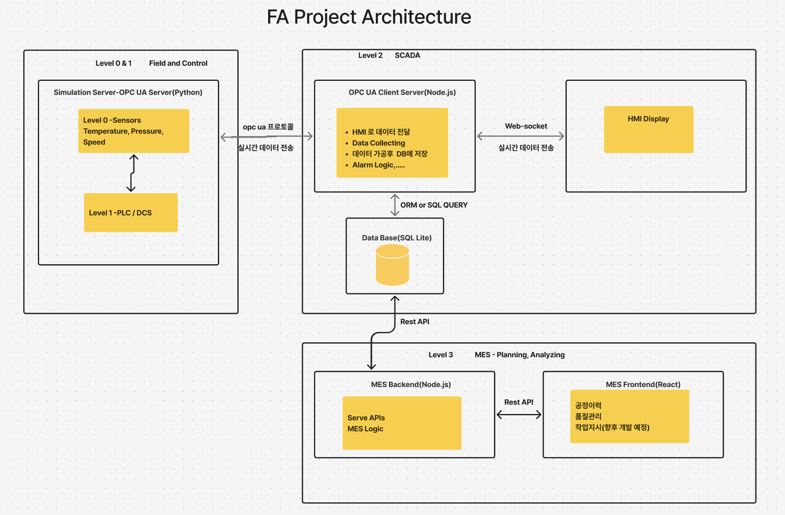

# 팩토리 자동화 쇼케이스: OPC UA 기반 실시간 데이터 모니터링 시스템

이 프로젝트는 가상 공장 환경에서 발생하는 데이터를 **수집, 처리, 시각화**하는 풀스택 애플리케이션입니다. 산업 표준인 **OPC UA 프로토콜**을 활용하여 센서 데이터를 시뮬레이션하고, 이를 효율적으로 수집하여 데이터베이스에 저장한 후, 웹 대시보드를 통해 **실시간으로 모니터링**하는 과정을 구현했습니다. 또한 공정이력 및 품질관리 로직을 구현함으로써 부분적인 MES를 구현하였습니다. 본 프로젝트는 산업 IoT 아키텍처, 마이크로서비스 설계, 그리고 현대적인 웹 개발 역량을 종합적으로 보여줍니다.

### [실행 영상 보기](https://www.youtube.com/watch?v=b8g7BET1AKY)

## 시스템 아키텍처



본 시스템은 확장성과 유지보수성을 고려하여 여러 독립적인 마이크로서비스로 구성되어 있습니다.

1.  **OPC UA Server (`opcua_server`)**: Python으로 구현된 가상 OPC UA 서버로, 실제와 유사한 센서 데이터를 생성합니다.
2.  **OPC UA Collector (`opcua_collector`)**: Node.js 기반의 데이터 수집기로, OPC UA 서버에 연결하여 주기적으로 데이터를 수집하고 데이터베이스에 저장하는 역할을 합니다.
3.  **Database (`shared_db`)**: 이 모듈은 데이터베이스 모델과 스토리지 로직을 정의하여 서비스 간 데이터 일관성을 보장합니다.
4.  **API Server (`api_server`)**: 데이터베이스에 저장된 센서 데이터를 프론트엔드에 제공하기 위한 REST API 서버입니다.
5.  **Frontend (`frontend`)**: React와 TypeScript로 구축된 웹 애플리케이션으로, API 서버로부터 데이터를 받아와 사용자에게 직관적인 실시간 대시보드 형태로 시각화하여 보여줍니다.

## 주요 기능 및 특징

*   **지연없는 실시간 데이터**: OPC UA Client 서버와 직접적으로 통신해 최신 센서 데이터를 지연 없이 확인할 수 있는 HMI 통해 즉각적인 센서의 값을 모니터링합니다.
*   **마이크로서비스 아키텍처**: 각 기능을 독립적인 서비스로 분리하여 개발 및 배포의 유연성을 확보하고, 시스템의 확장성과 유지보수 효율성을 극대화했습니다.
*   **산업 표준 프로토콜 활용 (OPC UA)**: 실제 산업 현장과 동일한 OPC UA 통신 환경을 시뮬레이션하여, 산업 자동화 분야에 대한 이해와 적용 능력을 보여줍니다.
*   **중앙 집중식 데이터 모델 관리**: `shared_db` 공통 모듈을 통해 여러 서비스 간의 데이터 모델 일관성을 유지하고, 코드 중복을 제거하여 개발 생산성을 향상시켰습니다.

## 기술적 도전 과제 및 해결 방안

프로젝트를 진행하며 마주했던 주요 기술적 난관과 이를 해결하기 위한 접근 방식은 다음과 같습니다.

### 1. 비동기 데이터 처리 및 동시성 제어

*   **도전 과제**: `opcua_collector`가 정해진 간격으로 데이터를 수집할 때, 네트워크 지연 등으로 이전 수집 작업이 길어질 경우 다음 작업과 겹쳐 데이터 무결성이 손상될 위험이 있었습니다.
*   **해결 방안**: `async/await`를 활용하여 비동기 작업을 명확하게 관리하고, 간단한 잠금(Lock) 플래그를 구현했습니다. 데이터 수집 시작 시 플래그를 활성화하고 완료 시 비활성화하여, 이전 작업이 끝나지 않았다면 새로운 작업을 시작하지 않도록 제어했습니다. 이를 통해 경쟁 상태(Race Condition)를 효과적으로 방지하고 데이터 수집의 안정성을 확보했습니다.

### 2. 마이크로서비스 간 데이터 모델 일관성 및 구조적 분리

*   **도전 과제**  초기에는 모든 기능을 하나의 애플리케이션으로 통합하는 방식이 단순해 보였지만, 실제 FA(Factory Automation) 환경에서는 OPC UA 데이터 수집, MES 로직, 품질 관리, 공정이력 등 각 기능이 **서로 다른 서버에서 독립적으로 운영**됩니다. 하나의 앱으로 묶어버리면 실제 산업 환경의 구조를 반영할 수 없고, 구성 요소 간 결합도가 높아져 확장성과 배포 유연성이 떨어지는 문제가 있었습니다.
*   **해결 방안**  현업 아키텍처와 동일한 구조를 재현하기 위해 모든 기능을 **마이크로서비스 단위로 분리**하고, 서비스 간 연동은 실제 제조 현장에서 사용하는 것과 유사한 **OPC UA, WebSocket, REST API 등 프로토콜 기반 통신**으로 구현했습니다. 이를 통해 데이터 수집기(opcua_collector), MES 역할의 API 서버, HMI/Dashboard가 서로 독립적으로 동작하면서도 실제 공장 시스템처럼 유기적으로 연동되는 구조를 완성했습니다.

## 기술 스택

*   **백엔드**: Node.js (Express), Python (asyncua)
*   **프론트엔드**: React, TypeScript
*   **데이터베이스**: Sequelize (ORM), SQL LITE
*   **프로토콜**: OPC UA, REST API, WebSocket
*   **개발 도구**: npm, uv

### 향후 개선 방향

- **MES 기능 고도화**  
  현재는 기본적인 데이터 수집·조회 중심이지만, 향후에는 실제 MES와 유사하도록  
  **공정 지시(Work Order) 발행**, **작업자 가이드라인 전달**, **설비별 작업 단계 관리** 등  
  생산 운영을 직접 제어할 수 있는 기능을 추가할 계획입니다.

- **프로젝트 컨테이너화(Docker) 진행**  
  각 서비스를 Docker 기반으로 컨테이너화하여 개발·운영 환경을 통일하고,  
  서비스 확장 및 서버 재배포 시 안정성을 높일 예정입니다.

- **배포 자동화(CI/CD) 구축**  
  GitHub Actions 또는 AWS CodePipeline 등을 활용해  
  **테스트 → 빌드 → 배포** 과정을 자동화함으로써  
  마이크로서비스 구조에서 발생하는 배포 복잡성을 줄이고 운영 효율성을 높일 계획입니다.

## 프로젝트 설치 및 실행

각 서비스는 독립적으로 실행됩니다.

### 1. 의존성 설치

각 프로젝트 디렉토리로 이동하여 필요한 의존성을 설치합니다.

```bash
# Frontend
cd frontend && npm install

# API Server
cd ../api_server && npm install

# OPC UA Collector
cd ../opcua_collector && npm install

# OPC UA Server (Python)
cd ../opcua_server && uv sync
```

### 2. 서비스 실행 순서

원활한 데이터 흐름을 위해 아래 순서대로 각 서비스를 **별도의 터미널**에서 실행하는 것을 권장합니다.

1.  **OPC UA 서버** 시작
2.  **OPC UA 컬렉터** 시작
3.  **API 서버** 시작
4.  **프론트엔드** 개발 서버 시작

## 라이선스

이 프로젝트는 [LICENSE](./LICENSE) 파일에 명시된 라이선스를 따릅니다.
