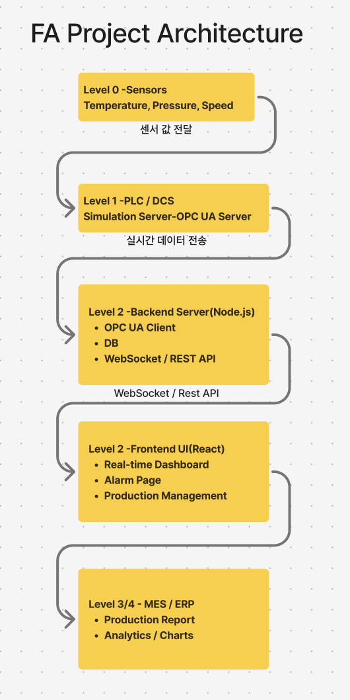

# 팩토리 자동화 쇼케이스 (Factory Automation Showcase)

이 프로젝트는 가상 공장 환경의 데이터를 수집, 처리, 시각화하는 풀스택 애플리케이션입니다. OPC UA 프로토콜을 사용하여 산업용 센서 데이터를 시뮬레이션하고, 이를 수집하여 데이터베이스에 저장한 후, 웹 대시보드를 통해 실시간으로 모니터링하는 과정을 보여줍니다.

## 아키텍처



1.  **OPC UA Server (`opcua_server`)**: Python으로 구현된 가상 OPC UA 서버가 센서 데이터를 생성합니다.
2.  **OPC UA Collector (`opcua_collector`)**: Node.js로 구현된 데이터 수집기가 OPC UA 서버에 연결하여 주기적으로 데이터를 수집하고 데이터베이스에 저장합니다.
3.  **Database (`shared_db`)**: 수집된 센서 데이터가 저장되는 공간입니다. `shared_db` 모듈은 데이터베이스 모델과 스토리지 로직을 정의합니다.
4.  **API Server (`api_server`)**: 데이터베이스에 저장된 센서 데이터를 조회할 수 있는 REST API를 제공합니다.
5.  **Frontend (`frontend`)**: React와 Vite로 구축된 웹 애플리케이션으로, API 서버로부터 데이터를 받아와 사용자에게 실시간 대시보드 형태로 시각화하여 보여줍니다.

## 주요 기능

- **실시간 데이터 시각화**: 최신 센서 데이터를 지연 없이 확인할 수 있는 동적 대시보드
- **마이크로서비스 아키텍처**: 각 기능(서버, 수집기, API, 프론트엔드)을 독립적인 서비스로 분리하여 개발 및 유지보수 효율성 증대
- **산업 표준 프로토콜 활용**: OPC UA를 사용하여 실제 산업 현장과 유사한 데이터 통신 환경 시뮬레이션
- **공통 모듈을 통한 일관성**: `shared_db` 모듈을 통해 여러 서비스 간의 데이터 모델 일관성 유지

## 기술적 도전 과제 및 해결 방안

### 1. 비동기 데이터 처리 및 동시성 제어
- **도전 과제**: `opcua_collector`가 정해진 간격으로 데이터를 수집할 때, 이전 수집 작업이 네트워크 지연 등으로 길어질 경우 다음 작업과 겹치면서 데이터의 무결성이 깨질 수 있는 위험이 있었습니다.
- **해결 방안**: `async/await`를 사용하여 비동기 작업을 명확하게 관리하고, 간단한 잠금(Lock) 플래그를 구현했습니다. 데이터 수집 시작 시 플래그를 활성화하고, 완료 시 비활성화하여 이전 작업이 끝나지 않았다면 새로운 작업을 시작하지 않도록 제어했습니다. 이를 통해 경쟁 상태(Race Condition)를 방지하고 데이터 수집의 안정성을 확보했습니다.

### 2. 마이크로서비스 간 데이터 모델 일관성 유지
- **도전 과제**: 데이터를 쓰는 `opcua_collector`와 데이터를 읽는 `api_server`가 동일한 데이터베이스 스키마를 참조해야 했습니다. 각 서비스에 모델을 개별적으로 정의하면, 스키마 변경 시 두 서비스의 코드를 모두 수정해야 하는 번거로움과 휴먼 에러의 가능성이 존재했습니다.
- **해결 방안**: 데이터베이스 모델과 연결 로직을 중앙에서 관리하는 `shared_db` 공통 모듈을 설계했습니다. 두 서비스는 이 모듈을 npm 패키지처럼 의존하여 사용함으로써 항상 최신화된 단일 스키마를 참조하게 만들었습니다. 이를 통해 코드 중복을 제거하고 유지보수성을 크게 향상시켰습니다.

## 주요 구성 요소

### 1. `opcua_server`
- **역할**: 가상 센서 데이터를 생성하는 OPC UA 서버입니다.
- **기술 스택**: Python, asyncua
- **실행 방법**:
  ```bash
  cd opcua_server
  # uv 또는 다른 Python 가상 환경 도구로 의존성 설치
  uv sync
  # 서버 실행
  uv run python main.py
  ```

### 2. `opcua_collector`
- **역할**: `opcua_server`로부터 데이터를 수집하여 데이터베이스에 저장합니다.
- **기술 스택**: Node.js
- **실행 방법**:
  ```bash
  cd opcua_collector
  npm install
  npm start
  ```

### 3. `api_server`
- **역할**: 저장된 센서 데이터를 프론트엔드로 전달하는 REST API 서버입니다.
- **기술 스택**: Node.js, Express (추정)
- **실행 방법**:
  ```bash
  cd api_server
  npm install
  npm start
  ```

### 4. `frontend`
- **역할**: 센서 데이터를 실시간으로 시각화하는 웹 대시보드입니다.
- **기술 스택**: React, TypeScript, Vite
- **실행 방법**:
  ```bash
  cd frontend
  npm install
  npm run dev
  ```

### 5. `shared_db`
- **역할**: 데이터베이스 모델(Schema)과 연결 로직을 포함하는 공유 모듈입니다.
- **기술 스택**: Node.js, Sequelize

## 전체 프로젝트 설치 및 실행

각 서비스는 독립적으로 실행되어야 합니다.

### 1. 의존성 설치

각 프로젝트 디렉토리로 이동하여 필요한 의존성을 설치합니다.

```bash
# Frontend
cd frontend && npm install

# API Server
cd ../api_server && npm install

# OPC UA Collector
cd ../opcua_collector && npm install

# OPC UA Server (Python)
cd ../opcua_server && uv sync
```

### 2. 실행 순서

원활한 데이터 흐름을 위해 아래 순서대로 각 서비스를 별도의 터미널에서 실행하는 것을 권장합니다.

1.  **OPC UA 서버** 시작
2.  **OPC UA 컬렉터** 시작
3.  **API 서버** 시작
4.  **프론트엔드** 개발 서버 시작

## 라이선스

이 프로젝트는 [LICENSE](./LICENSE) 파일에 명시된 라이선스를 따릅니다.